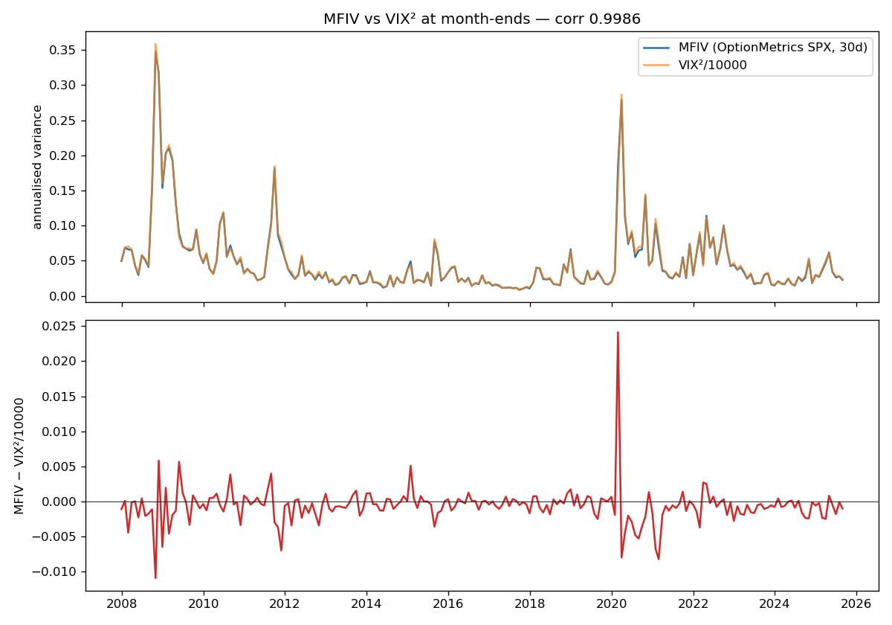
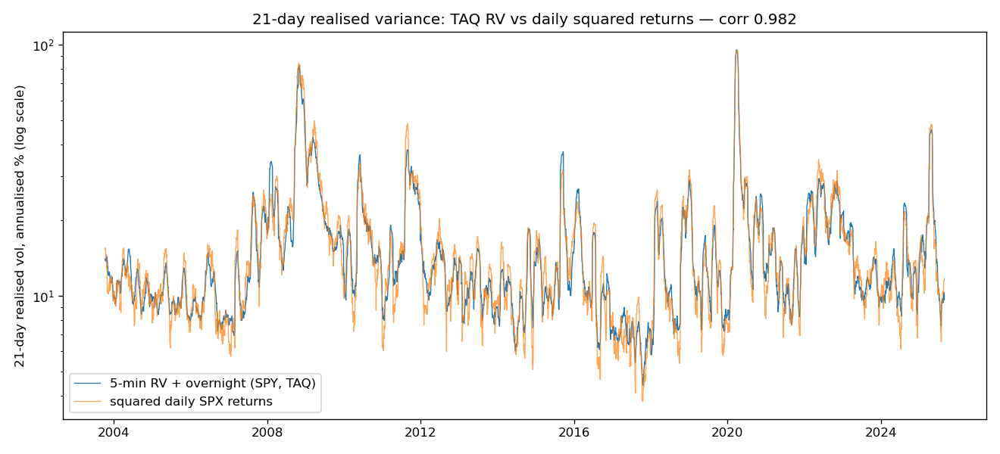
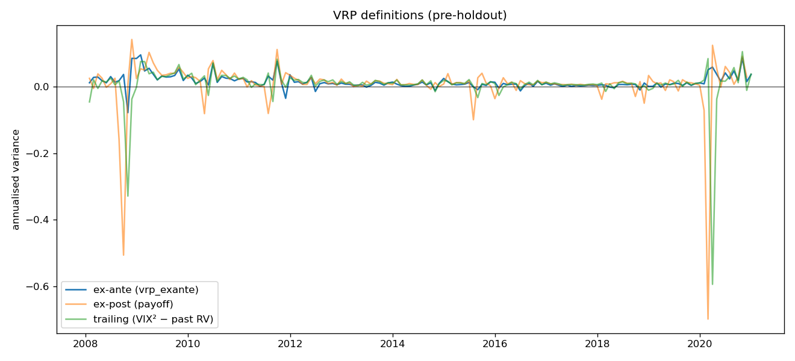
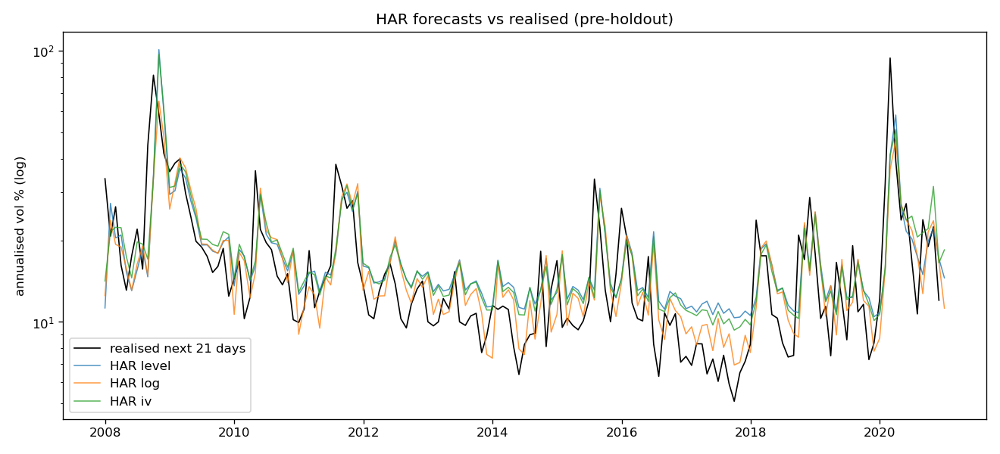

# Equity Variance Risk Premium: Predictability, Stability and an Economical Trading Strategy

QF603 Quantitative Analysis of Financial Markets — draft generated 2026-09-24 by `python -m src.report.build`.
Every table and figure below is produced by the project pipeline; sections still waiting on inputs say so.

## 1. Introduction

Option prices embed a premium for bearing variance risk. We measure the S&P 500 one-month variance risk
premium (VRP) as model-free implied variance minus a real-time forecast of realised variance, and ask
(Q1) how persistent it is, (Q2) which volatility-market, funding, credit, dealer-capital and positioning
variables forecast it 1, 3 and 6 months ahead, (Q3) whether those relationships are stable across calm and
stressed markets, (Q4) whether they survive the ex-post payoff definition and genuine out-of-sample tests,
(Q5) whether VRP forecasts equity excess returns, and (Q6) whether the findings support an economical,
cost-aware short-variance strategy.

Sample: 2008-01-31 to 2025-08-29 (month-ends); train to 2015-12-31, validate to 2020-12-31,
holdout to 2025-08-29 (used once, after every specification was frozen).

## 2. Data and measurement

### 2.1 Sources

| Series | Source | Coverage used |
| --- | --- | --- |
| SPX options (month-end ± 3 trading days), zero curve, SPX index | WRDS OptionMetrics | 2007-12 → 2025-08 |
| SPY trades (5-minute bars, regular hours) | WRDS daily TAQ | 2003-09-10 → 2025-08 (HAR burn-in from 2003) |
| CP and T-bill rates, Moody's BAA/AAA | FRED (1-business-day publication lag) | 2008 → 2025-08 |
| VIX-futures positioning (TFF, dealers / leveraged funds) | CFTC Public Reporting API | release-dated; Jan–May 2009 and Jan–Feb 2019 missing |
| VIX, VIX3M, VVIX, SKEW, SPXT, PUT, BXM | Bloomberg | _pending user export_ |
| Intermediary capital ratio | He–Kelly–Manela (3-month publication lag) | _pending user download_ |

OptionMetrics on WRDS ends on 2025-08-29, so the sample was shortened from December to August 2025 (D017).
All conventions, with reasons and alternatives, are logged in `DECISIONS.md`; coverage details in `DATA_INVENTORY.md`.

### 2.2 Implied variance

Thirty-day model-free implied variance follows the Cboe VIX methodology on OptionMetrics closing quotes
(two expiries bracketing 30 days, forward from put–call parity, OTM strip with the two-zero-bid rule, total
variance interpolated to 30 days; AM-settled series expire at 09:30 on the settlement Friday, D028).
All 213 month-ends were computed on the month-end itself (0 fallbacks). Correlation
with VIX²/10000 is **0.9986** (gate > 0.99); the average gap is -0.16 vol points and
97% of months are within one vol point.

*MFIV vs VIX² at month-ends*

### 2.3 Realised variance

Daily realised variance of SPY is the sum of squared 5-minute returns on the NYSE regular-hours grid (78
buckets; 42 on early closes) plus the squared overnight return (Hansen & Lunde 2005), from 2003-09-10 to
2025-08-29 (5,528 days). Two reverting bad prints were replaced by the bucket VWAP (D036). The
overnight return contributes 37.5% of total variance. The 21-day RV correlates **0.982**
with 21-day sums of squared SPX returns and peaks in March 2020 and October–November 2008.

*21-day realised volatility: TAQ RV vs squared daily SPX returns*

### 2.4 Expected realised variance (HAR) and the VRP

Expected one-month RV is a recursive HAR forecast re-estimated at each month-end on targets already observed.
Three variants were evaluated on pre-holdout data only; the **log HAR** was chosen as the headline
before any predictability regression was run (D037–D038):

| period                  | variant   |   nobs |   mz_b |   mz_wald_p |   mz_r2 |   mse |   qlike |   dm_t_qlike_vs_level |   share_vrp_exante_pos |   min_vrp_exante |
|:------------------------|:----------|-------:|-------:|------------:|--------:|------:|--------:|----------------------:|-----------------------:|-----------------:|
| 2008-2020 (pre-holdout) | level     |    155 |  0.485 |       0.000 |   0.210 | 0.009 |   0.342 |               nan     |                  0.813 |           -0.671 |
| 2008-2020 (pre-holdout) | log       |    155 |  1.097 |       0.340 |   0.300 | 0.006 |   0.358 |                 0.831 |                  0.916 |           -0.077 |
| 2008-2020 (pre-holdout) | iv        |    155 |  0.536 |       0.008 |   0.222 | 0.009 |   0.315 |                -1.774 |                  0.910 |           -0.589 |
| train (≤ 2015-12-31)    | level     |     96 |  0.390 |       0.000 |   0.270 | 0.009 |   0.322 |               nan     |                  0.854 |           -0.671 |
| train (≤ 2015-12-31)    | log       |     96 |  0.909 |       0.118 |   0.364 | 0.004 |   0.335 |                 0.715 |                  0.927 |           -0.077 |
| train (≤ 2015-12-31)    | iv        |     96 |  0.423 |       0.000 |   0.279 | 0.008 |   0.295 |                -1.196 |                  0.917 |           -0.589 |
| validate                | level     |     59 |  1.324 |       0.818 |   0.289 | 0.010 |   0.373 |               nan     |                  0.746 |           -0.057 |
| validate                | log       |     59 |  1.938 |       0.588 |   0.322 | 0.010 |   0.396 |                 0.516 |                  0.898 |           -0.012 |
| validate                | iv        |     59 |  1.712 |       0.648 |   0.361 | 0.009 |   0.348 |                -1.895 |                  0.898 |           -0.017 |

Ex-ante VRP = MFIV − E_t[RV] (known at t). The ex-post VRP (MFIV − realised RV over the next 21 trading days)
is the short variance-swap payoff; it is a target only, dated by when it becomes known. The trailing VRP
(VIX² − past RV) follows Bollerslev, Tauchen & Zhou (2009) and is used for Q5 only.

*VRP definitions, pre-holdout*

*HAR forecasts vs realised variance, pre-holdout*

## 3. Results (in-sample 2008–2020)

### Q1 — Persistence

_Pending: `outputs/tables/stage1_persistence.csv` not built yet._

_Pending: `outputs/tables/stage1_ar2.csv` not built yet._

_Pending figure: `outputs/figures/lp_rv_surprise.png`._

### Q2 — Drivers

_Pending: `outputs/tables/stage1_single.csv` not built yet._

_Pending: `outputs/tables/stage2_collinearity.csv` not built yet._

_Pending: `outputs/tables/stage2_ols.csv` not built yet._

_Pending: `outputs/tables/stage2_pca_variance.csv` not built yet._

_Pending figure: `outputs/figures/stage2_scree.png`._

_Pending figure: `outputs/figures/stage2_ridge_path.png`._

### Q3 — Stability

_Pending: `outputs/tables/stage3_interactions.csv` not built yet._

_Pending: `outputs/tables/stage3_break_test.csv` not built yet._

_Pending figure: `outputs/figures/rolling_betas_all.png`._

_Pending: `outputs/tables/stage3_ex2008_09_single.csv` not built yet._

## 4. Robustness and out-of-sample (Q4)

_Pending: `outputs/tables/stage4_bridge_insample.csv` not built yet._

_Pending: `outputs/tables/stage4_expost_single.csv` not built yet._

_Pending: `outputs/tables/stage4_selection.csv` not built yet._

_Pending figure: `outputs/figures/oos_cum_sse.png`._

_Validation metrics for PCA / ridge are tuned on the same window; only the holdout (§7) is a clean test._

## 5. Returns (Q5)

_Pending: `outputs/tables/stage5_insample.csv` not built yet._

_Pending: `outputs/tables/stage5_oos_validation.csv` not built yet._

## 6. Economic significance: trading the VRP (Q6)

The traded unit is a short one-month at-the-money SPX straddle with a long ~10-delta put wing, delta-hedged
daily and held to cash settlement; each position is sized so that an SPX −15% / IV × 2 shock costs 20% of
capital, and a month is traded only if its expected P&L exceeds 1.5 × expected round-trip costs (D041–D043).
S0 is always short; S1 is timed by ex-ante VRP; S2 by the Stage 4 payoff forecast.

_Pending: `outputs/tables/strategy_validation.csv` not built yet._

_Pending: `outputs/tables/strategy_costs.csv` not built yet._

_Pending figure: `outputs/figures/strategy_cum_pnl.png`._

_Pending figure: `outputs/figures/strategy_drawdown.png`._

_Pending figure: `outputs/figures/strategy_cost_breakeven.png`._

_Pending: `outputs/tables/strategy_stress.csv` not built yet._

## 7. Holdout (2021–2025, run once)

_Pending: `outputs/tables/holdout/stage4_oos_metrics_holdout.csv` not built yet._

_Pending: `outputs/tables/holdout/stage5_oos_holdout.csv` not built yet._

_Pending: `outputs/tables/holdout/strategy_holdout_frozen_variants.csv` not built yet._

### Extended sample (confirmatory)

_Pending: `outputs/tables/holdout/extended_stage1_persistence.csv` not built yet._

## 8. Case studies
_Pending: Bloomberg event-window exports (PLAN Phase 5)._

## 9. Limitations

* Sample ends 2025-08 (OptionMetrics coverage), shortening the holdout to 56 months.
* ~155 pre-holdout months with overlapping targets: inference relies on HAC and block-bootstrap corrections.
* SPY's quarterly ex-dividend drops enter overnight returns (not adjusted, D031).
* AM settlement is proxied by the SPX open; the hedge uses the SPX index as a futures proxy (no carry).
* CFTC release dates are inferred; shutdown backlogs are dated conservatively (D025).
* Before 2013 the traded expiry is usually the third-Friday monthly, so positions cover ~2/3 of each month.

## 10. Conclusion
_Written after the holdout run._

## References
Bailey & López de Prado (2014); Bekaert & Hoerova (2014); Bollerslev, Tauchen & Zhou (2009); Bollerslev,
Todorov & Xu (2015); Britten-Jones & Neuberger (2000); Campbell & Thompson (2008); Carr & Wu (2009); Clark & West
(2007); Corsi (2009); Diebold & Mariano (1995); Fleming, Kirby & Ostdiek (2001); Fournier, Jacobs & Orłowski (2024);
Goetzmann, Ingersoll, Spiegel & Welch (2007); Goyal, Welch & Zafirov (2024); Hansen (2000); Hansen & Lunde (2005);
He, Kelly & Manela (2017); Hodrick (1992); Ledoit & Wolf (2008); Patton (2011); Stambaugh (1999).
